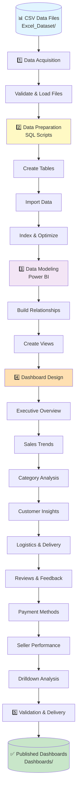

# Olist Sales Analytics

## Project Overview

This repository demonstrates a professional Power BI analytics solution built around the Olist sales dataset. The project includes:

- curated CSV datasets for customers, orders, products, payments, reviews, sellers, and geolocation
- SQL scripts to prepare and model data for reporting
- a sequenced portfolio of Power BI dashboards that tell the story of sales, customer behavior, logistics, payments, and product performance

The goal is to transform raw e-commerce transaction data into a scalable analytics workflow and executive-ready visualization suite.

## Project Structure

- `Excel_Dataset/` — source CSV files from the Olist dataset
- `All Queries/` — SQL artifacts for loading, indexing, and data preparation
- `Dashboards/` — Power BI dashboard screenshots documenting each report page

## Workflow Overview

### Workflow Flowchart

### Step-by-Step Workflow

### 1. Data Acquisition

Collect the source CSV datasets from `Excel_Dataset/` and confirm file integrity before import.

### 2. Data Preparation

Use the scripts in `All Queries/Query/` to:

- create database tables for each dataset
- import large CSV volumes (including support for 1,000,000+ rows)
- define foreign keys and staging views
- optimize query performance with indexes and transformed views

### 3. Data Modeling

Build a Power BI data model that connects:

- orders to customers and sellers
- order items to products and categories
- orders to payments and reviews
- customer locations to geolocation data

This model supports fast cross-filtering, trend analysis, and drilldown capabilities.

### 4. Dashboard Design

Develop a set of Power BI report pages that answer executive, operational, and tactical questions.

### 5. Validation & Delivery

Validate the dashboards using data quality checks, cross-table reconciliations, and performance reviews. Use the included screenshots as a reference for layout, navigation, and storytelling.

## Dashboard Gallery (Ordered)

### 1. Executive Overview

A high-level performance page that combines revenue, order volume, average ticket value, and customer metrics for quick executive review.

### 2. Sales Trends

Trends over time and category performance to monitor revenue growth, seasonality, and product demand shifts.

### 3. Category vs Product

Comparison of category-level and product-level revenue, allowing business users to identify top-performing merchandise and product mix opportunities.

### 4. Customers

Customer analytics for new vs returning buyers, buyer locations, loyalty patterns, and satisfaction signals.

### 5. Delivery & Logistics

Operational insights into delivery time, shipment performance, and logistics bottlenecks across regions.

### 6. Review Analysis

Customer feedback and review sentiment patterns that help correlate satisfaction with order performance.

### 7. Payment Insights

Payment method distribution, transaction behavior, and revenue by payment type.

### 8. Seller Performance

Seller-level performance monitoring to identify the strongest partners and surface sellers with growth potential.

### 9. Drilldown Analysis

Detailed drilldown page for interactive investigation across products, customers, sellers, and orders.

## Data Sources

The analytics solution uses the following dataset files from `Excel_Dataset/`:

- `olist_customers_dataset.csv`
- `olist_geolocation_dataset.csv`
- `olist_order_items_dataset.csv`
- `olist_order_payments_dataset.csv`
- `olist_order_reviews_dataset.csv`
- `olist_orders_dataset.csv`
- `olist_products_dataset.csv`
- `olist_sellers_dataset.csv`
- `product_category_name_translation.csv`

## SQL Support

The repository includes SQL scripts to support data preparation, loading, and optimization.

### SQL artifacts

- `All Queries/Query/Create Table.sql` — table creation statements for all dataset sources
- `All Queries/Query/For Importing 10lac Data.sql` — import strategy for large volumes of data
- `All Queries/Query/Foreign Table.sql` — foreign key and relational structure definitions
- `All Queries/Query/Indexing.sql` — indexing for improved query performance
- `All Queries/Query/View Table.sql` — prepared views for reporting and analytics

## Recommended Usage

1. Verify the CSV files in `Excel_Dataset/` and load them into your analytical database or Power BI.
2. Run the SQL scripts in `All Queries/Query/` to build the prepared dataset.
3. Establish relationships in Power BI using the imported tables.
4. Build report pages following the ordered dashboard gallery above.
5. Use the screenshots in `Dashboards/` as a design and validation reference.

## Outcome

This project provides a complete end-to-end analytical workflow from raw e-commerce transaction files to executive dashboard storytelling. It is designed to help stakeholders visualize sales performance, customer behavior, logistics operations, payment trends, and seller effectiveness.

---

## Notes

- The screenshots are referenced with relative paths from this README.
- Keep the folder structure intact for GitHub preview compatibility.
