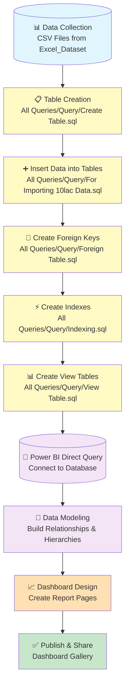

# Olist Sales Analytics

## Project Overview

This repository demonstrates a professional Power BI analytics solution built around the Olist sales dataset. The project includes:

- curated CSV datasets for customers, orders, products, payments, reviews, sellers, and geolocation
- SQL scripts to prepare and model data for reporting
- a sequenced portfolio of Power BI dashboards that tell the story of sales, customer behavior, logistics, payments, and product performance

The goal is to transform raw e-commerce transaction data into a scalable analytics workflow and executive-ready visualization suite.

## Project Structure

- `Excel_Dataset/` — source CSV files from the Olist dataset
- `All Queries/` — SQL artifacts for loading, indexing, and data preparation
- `Dashboards/` — Power BI dashboard screenshots documenting each report page

## Workflow Overview

### Workflow Flowchart

### Step-by-Step Workflow

### 1. Data Collection

Extract and validate the source CSV datasets from `Excel_Dataset/`:
- `olist_customers_dataset.csv`
- `olist_orders_dataset.csv`
- `olist_order_items_dataset.csv`
- `olist_products_dataset.csv`
- `olist_sellers_dataset.csv`
- `olist_payments_dataset.csv`
- `olist_reviews_dataset.csv`
- `olist_geolocation_dataset.csv`
- `product_category_name_translation.csv`

### 2. Table Creation

Run `All Queries/Query/Create Table.sql` to:
- Define schema and table structures in your database
- Set up columns, data types, and constraints
- Prepare staging tables for data import
- Establish the foundation for the data warehouse

### 3. Insert Data into Tables

Execute `All Queries/Query/For Importing 10lac Data.sql` to:
- Load CSV data into the created tables
- Support large-volume imports (1,000,000+ rows)
- Use bulk insert operations for optimal performance
- Validate data integrity during import

### 4. Create Foreign Keys

Run `All Queries/Query/Foreign Table.sql` to:
- Define relationships between tables
- Link orders to customers and sellers
- Connect order items to products
- Establish referential integrity constraints
- Enable data consistency across the warehouse

### 5. Create Indexes

Execute `All Queries/Query/Indexing.sql` to:
- Create primary keys on unique identifiers
- Build indexes on frequently queried columns
- Optimize join performance between tables
- Improve overall query execution speed
- Support faster Power BI data refresh

### 6. Create View Tables

Run `All Queries/Query/View Table.sql` to:
- Build aggregated and transformed views
- Create flattened structures for reporting
- Pre-calculate common metrics
- Prepare optimized data structures for Power BI
- Simplify Power BI Direct Query connections

### 7. Power BI Direct Query

Connect Power BI to the prepared database:
- Establish a live connection to the database
- Use Direct Query mode for real-time data updates
- Reference views and tables created in step 6
- Build a semantic model with relationships
- Create calculations and measures

### 8. Data Modeling

In Power BI, build the analytical data model:
- Create relationships between dimensions and facts
- Define hierarchies (e.g., Date, Geography, Product Category)
- Add calculated columns and measures
- Set up row-level security if needed
- Optimize for report performance

### 9. Dashboard Design

Develop Power BI report pages covering:
- Executive Overview dashboard
- Sales Trends analysis
- Category vs Product comparison
- Customer analytics and segmentation
- Delivery and logistics monitoring
- Review sentiment analysis
- Payment method insights
- Seller performance tracking
- Drilldown analysis capabilities

### 10. Publish & Share

Validate and publish dashboards:
- Test cross-filtering and interactions
- Validate data accuracy and reconciliation
- Set up refresh schedules
- Share with stakeholders
- Monitor performance and usage

## Dashboard Gallery (Ordered)

### 1. Executive Overview

A high-level performance page that combines revenue, order volume, average ticket value, and customer metrics for quick executive review.

### 2. Sales Trends

Trends over time and category performance to monitor revenue growth, seasonality, and product demand shifts.

### 3. Category vs Product

Comparison of category-level and product-level revenue, allowing business users to identify top-performing merchandise and product mix opportunities.

### 4. Customers

Customer analytics for new vs returning buyers, buyer locations, loyalty patterns, and satisfaction signals.

### 5. Delivery & Logistics

Operational insights into delivery time, shipment performance, and logistics bottlenecks across regions.

### 6. Review Analysis

Customer feedback and review sentiment patterns that help correlate satisfaction with order performance.

### 7. Payment Insights

Payment method distribution, transaction behavior, and revenue by payment type.

### 8. Seller Performance

Seller-level performance monitoring to identify the strongest partners and surface sellers with growth potential.

### 9. Drilldown Analysis

Detailed drilldown page for interactive investigation across products, customers, sellers, and orders.

## Data Sources

The analytics solution uses the following dataset files from `Excel_Dataset/`:

- `olist_customers_dataset.csv`
- `olist_geolocation_dataset.csv`
- `olist_order_items_dataset.csv`
- `olist_order_payments_dataset.csv`
- `olist_order_reviews_dataset.csv`
- `olist_orders_dataset.csv`
- `olist_products_dataset.csv`
- `olist_sellers_dataset.csv`
- `product_category_name_translation.csv`

## SQL Support

The repository includes SQL scripts to support data preparation, loading, and optimization.

### SQL artifacts

- `All Queries/Query/Create Table.sql` — table creation statements for all dataset sources
- `All Queries/Query/For Importing 10lac Data.sql` — import strategy for large volumes of data
- `All Queries/Query/Foreign Table.sql` — foreign key and relational structure definitions
- `All Queries/Query/Indexing.sql` — indexing for improved query performance
- `All Queries/Query/View Table.sql` — prepared views for reporting and analytics

## Recommended Usage

1. Verify the CSV files in `Excel_Dataset/` and load them into your analytical database or Power BI.
2. Run the SQL scripts in `All Queries/Query/` to build the prepared dataset.
3. Establish relationships in Power BI using the imported tables.
4. Build report pages following the ordered dashboard gallery above.
5. Use the screenshots in `Dashboards/` as a design and validation reference.

## Outcome

This project provides a complete end-to-end analytical workflow from raw e-commerce transaction files to executive dashboard storytelling. It is designed to help stakeholders visualize sales performance, customer behavior, logistics operations, payment trends, and seller effectiveness.

---

## Notes

- The screenshots are referenced with relative paths from this README.
- Keep the folder structure intact for GitHub preview compatibility.
